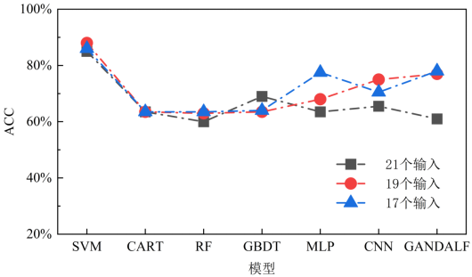
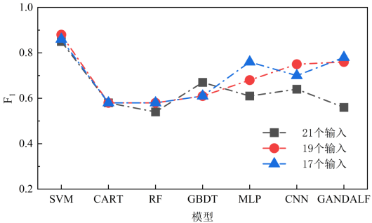
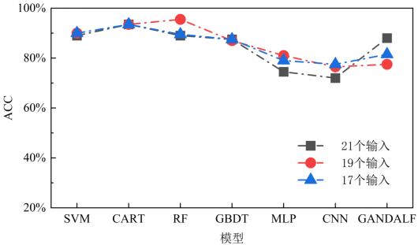
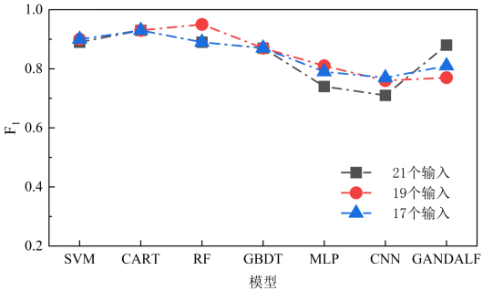
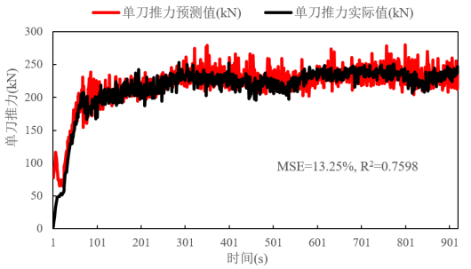
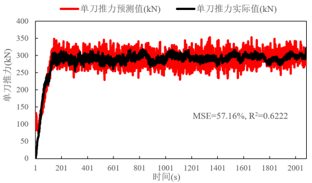
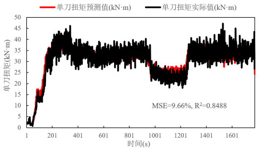
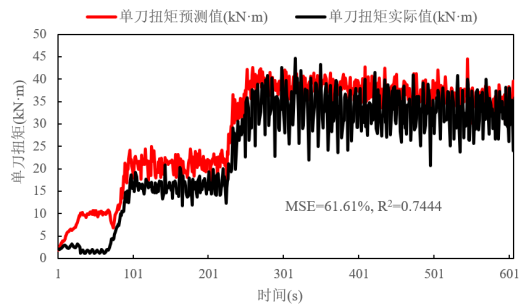

# A Study on Rock Mass Accurate Classification based on Multi-Algorithm Cross Multi-Feature Optimization Selection and TBM Parameter Efficient Prediction Using Low-Dimensional Inputs
## Introduction
This is an official code for the 2nd TBM machine learning competition. The authors include Xinyue Zhang*, Bowen Zhang* and Boxuan Zhang*.

It should be noted that this implementation is just focused on classification and parameter prediction tasks, with no mention of data cleaning and pre-processing.

## Project Overview
```
Classification/
    codes/
        # codes for classification task(include 2-cls and 4-cls)
    data/
        # data for classification
    save_models/
Regression/
    codes/
        GANDALF-regression.py
        trainer_cfg.yml
    data/
        train/
            F_train/
                # data for thrust force prediction
            T_train/
                # data for cutterhead torque prediction
    save_models/
results/
    # classification and parameter prediction results
```

## Results
### 4-Class Classification
<figure>
    
    
</figure>

### 2-Class Classification
<figure>
    
    
</figure>

### Example for Thrust Force Prediction
<figure>
    
    
</figure>

### Example for Cutterhead Torque Prediction
<figure>
    
    
</figure>